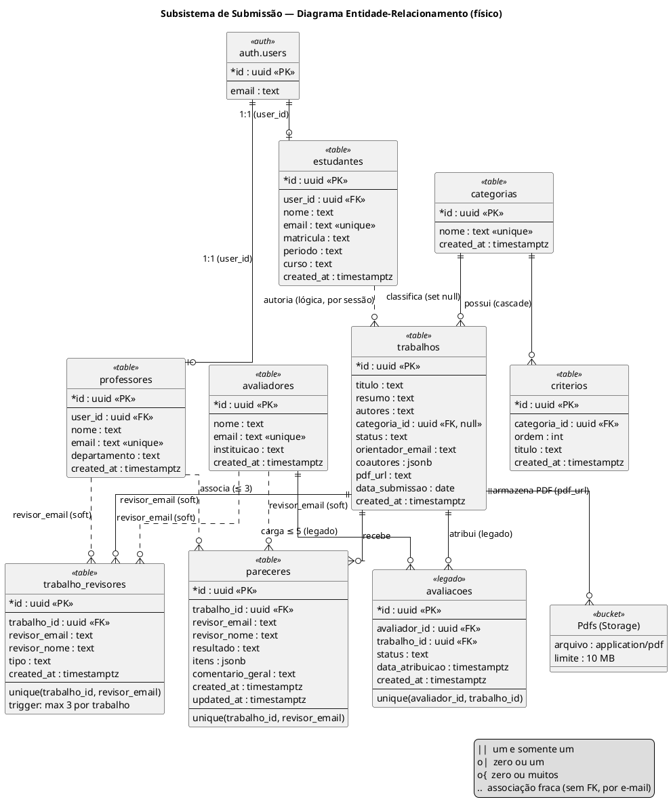
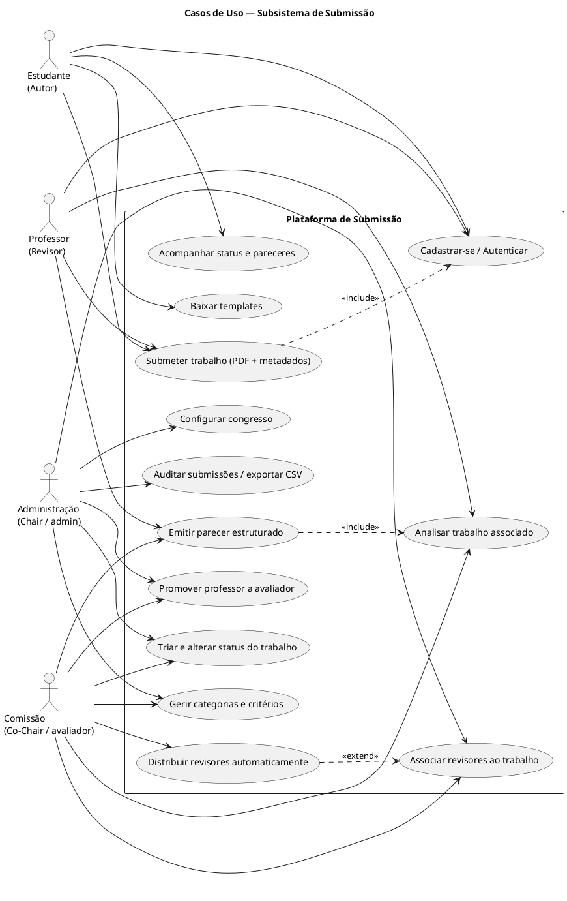

# Subsistema de Submissão de Trabalhos Científicos — UFLA

### Uma descrição técnico-científica da arquitetura, do modelo de dados e dos fluxos de uso

---

## Resumo

Este documento descreve, em estilo de artigo técnico-científico, o **subsistema de
submissão** da plataforma *Unified Congress UFLA* — a aplicação web construída para
gerir o congresso de iniciação científica da Universidade Federal de Lavras. A
plataforma é decomponível em três grandes partes funcionais: (i) a **submissão** de
trabalhos pelos estudantes-autores; (ii) a **análise e revisão** dos trabalhos
submetidos; e (iii) o **registro e a entrada de eventos** (gestão do congresso
propriamente dito, sob a rota `/congresso`). O objeto central deste texto é a primeira
parte — a submissão —, mas, como o ato de submeter está fortemente acoplado aos perfis
de **Revisor (Co-Chair)**, **Comissão Avaliadora** e **Administração**, esses papéis e
as estruturas de dados que compartilham são descritos sempre que o acoplamento o exigir.

O documento está organizado da seguinte forma: a Seção 1 apresenta a arquitetura geral
e a pilha tecnológica; a Seção 2 delimita a fronteira do subsistema de submissão; a
Seção 3 descreve o modelo de dados (entidades, relacionamentos e regras de
integridade); a Seção 4 fornece instruções e o código-fonte PlantUML para a geração do
DER/MER; a Seção 5 detalha os casos de uso e os caminhos de cada ator; e a Seção 6
discute as decisões de projeto e suas limitações.

---

## 1. Arquitetura do Sistema

### 1.1 Visão geral

A aplicação adota uma arquitetura **cliente-servidor de página única (SPA)** apoiada
em um *Backend-as-a-Service* (BaaS). Não há um servidor de aplicação intermediário
escrito sob medida: o cliente React comunica-se diretamente com a plataforma
**Supabase**, que provê banco de dados relacional, autenticação, armazenamento de
arquivos e uma API REST gerada automaticamente. A lógica de negócio reside em duas
camadas complementares — no cliente (validações, orquestração de chamadas, regras de
distribuição) e no banco (restrições de integridade, *triggers* e políticas de
segurança em nível de linha).

```
┌──────────────────────────────────────────────────────────────────┐
│                          NAVEGADOR (cliente)                       │
│                                                                    │
│   React 18 + TypeScript + Vite                                     │
│   ┌──────────────┐  ┌──────────────┐  ┌────────────────────────┐  │
│   │   Páginas    │  │  Componentes │  │  Camada de Serviços     │  │
│   │  (rotas /…)  │  │  (shadcn/ui) │  │  revisorService.ts      │  │
│   │              │  │              │  │  avaliacaoService.ts    │  │
│   └──────┬───────┘  └──────────────┘  └───────────┬────────────┘  │
│          │     AuthContext (sessão + papel)       │               │
│          └──────────────────┬─────────────────────┘               │
│                             │ supabase-js (HTTPS)                  │
└─────────────────────────────┼──────────────────────────────────────┘
                              │
        ┌──────────────────────▼──────────────────────────┐
        │                   SUPABASE (BaaS)                 │
        │   ┌───────────┐  ┌──────────┐  ┌──────────────┐  │
        │   │ PostgREST │  │   Auth   │  │   Storage    │  │
        │   │ (API REST)│  │ (JWT)    │  │ (bucket Pdfs)│  │
        │   └─────┬─────┘  └────┬─────┘  └──────┬───────┘  │
        │         │             │               │          │
        │   ┌──────▼─────────────▼───────────────▼──────┐  │
        │   │        PostgreSQL + Row Level Security      │  │
        │   └────────────────────────────────────────────┘  │
        └────────────────────────────────────────────────────┘
```

### 1.2 Pilha tecnológica

| Camada | Tecnologia | Função no subsistema de submissão |
|---|---|---|
| **Front-end** | React 18 + TypeScript | Componentização da interface e tipagem estática dos modelos de dados |
| **Build/Dev** | Vite | Empacotamento, *hot reload* e geração do *bundle* de produção |
| **Componentes de UI** | shadcn/ui + Radix UI + Tailwind CSS | Primitivas acessíveis (formulários, tabelas, diálogos) das telas de gestão |
| **Roteamento** | React Router v6 | Definição de rotas e guardas de acesso (`ProtectedRoute`) |
| **Formulários/validação** | React Hook Form + Zod | Validação de esquema na submissão (ex.: `TrabalhoForm`) |
| **Estado assíncrono** | TanStack React Query | Cache e sincronização de consultas |
| **Notificações** | Sonner | *Toasts* de sucesso/erro nas ações do usuário |
| **Back-end / Banco** | Supabase (PostgreSQL + PostgREST) | Persistência relacional e API REST automática |
| **Autenticação** | Supabase Auth (JWT) | Cadastro, login e sessão; metadados de perfil |
| **Armazenamento** | Supabase Storage (bucket `Pdfs`) | Guarda do PDF do trabalho; a tabela retém apenas o *link* |
| **Migrações** | SQL versionado + `scripts/migrate.js` | Evolução incremental do esquema via Management API |
| **Runtime** | Node.js 20 | Ambiente de desenvolvimento e execução das migrações |

### 1.3 Organização do código-fonte

O código relevante ao subsistema de submissão distribui-se assim:

```
src/
├── contexts/AuthContext.tsx        # Sessão global + resolução de papel (RBAC)
├── components/ProtectedRoute.tsx   # Guarda de rotas por papel
├── pages/
│   ├── Cadastro.tsx                # Cadastro do estudante-autor
│   ├── ProfessorCadastro.tsx       # Cadastro do professor (revisor)
│   ├── Estudante.tsx               # PORTAL DE SUBMISSÃO (núcleo do subsistema)
│   ├── Revisor.tsx                 # Painel do revisor / Co-Chair (análise + parecer)
│   ├── AdminPortal.tsx             # Portal da Comissão Organizadora (auditoria)
│   ├── Atribuicoes.tsx             # Associação revisor ↔ trabalho
│   ├── Categorias.tsx              # Categorias e critérios de avaliação
│   ├── Trabalhos.tsx / TrabalhoForm.tsx / TrabalhoDetalhe.tsx
│   └── Avaliadores.tsx            # Promoção de professores a avaliadores
├── services/
│   ├── revisorService.ts           # Associação e pareceres (lógica de negócio)
│   └── avaliacaoService.ts         # Distribuição de carga (modelo legado)
└── integrations/supabase/          # Cliente e tipos gerados
supabase/migrations/                # Evolução do esquema (SQL)
```

---

## 2. Delimitação do Subsistema de Submissão

### 2.1 Fronteira funcional

O subsistema de submissão compreende todo o caminho percorrido por um **trabalho
científico** desde a sua criação por um autor até o momento em que ele recebe um
**parecer** e tem seu **status** consolidado. Compreende portanto:

1. O **cadastro** e a **autenticação** do autor;
2. O **envio do trabalho** (metadados + arquivo PDF), no Portal do Estudante;
3. O **acompanhamento** do status pelo autor;
4. A **triagem e mudança de status** pela Administração;
5. A **associação** de revisores ao trabalho (atribuição);
6. A **emissão de parecer** pelo revisor;
7. A **consolidação** do resultado e auditoria.

### 2.2 Acoplamento entre perfis (declaração importante)

Embora o autor da submissão seja o **estudante**, o ato de submeter está acoplado a
três outros papéis que operam sobre a *mesma* entidade central (`trabalhos`):

- **Revisor (Co-Chair)** — papel exercido por **professores** e **avaliadores**,
  tratados de forma idêntica pelo sistema. Recebe trabalhos associados ao seu e-mail,
  analisa o PDF e emite um parecer estruturado.
- **Comissão Avaliadora** — o perfil `avaliador`. Além de poder revisar, possui o
  *dashboard* de gestão (atribuições, trabalhos, categorias/critérios). É o que o
  enunciado chama de **Co-Chair** no plano operacional.
- **Administração** — perfil único `admin`, o *chair* do sistema. Concentra a
  auditoria global, o controle de status e a configuração do congresso.

Por esse acoplamento, as entidades `categorias`, `criterios`, `trabalho_revisores` e
`pareceres` — embora "pertençam" à análise — são descritas aqui, pois sem elas a
submissão não se fecha como processo.

### 2.3 Controle de acesso baseado em papéis (RBAC)

O papel do usuário **não** é uma coluna; é **resolvido em tempo de login**
(`AuthContext.resolveRole`) por consultas em ordem de prioridade:

| Verificação | Papel atribuído |
|---|---|
| E-mail igual à constante `ADMIN_EMAIL` | `admin` |
| E-mail presente na tabela `avaliadores` | `avaliador` |
| E-mail presente na tabela `professores` | `professor` |
| Caso contrário | `estudante` |

O componente `ProtectedRoute` aplica a guarda: usuários não autenticados vão para
`/login`; usuários com papel insuficiente são redirecionados ao seu próprio portal.
A matriz de acesso relevante ao subsistema é:

| Papel | Rotas acessíveis |
|---|---|
| **estudante** | `/estudante` |
| **professor** | `/estudante`, `/revisor` |
| **avaliador** (Co-Chair) | tudo do professor + `/dashboard`, `/trabalhos`, `/categorias`, `/atribuicoes`, `/avaliadores` |
| **admin** | tudo do avaliador + `/admin` |

---

## 3. Modelo de Dados (Entidades e Relacionamentos)

Todas as tabelas residem no esquema `public` do PostgreSQL, com *Row Level Security*
habilitada. Nesta fase do projeto, as políticas são **permissivas** (acesso público
via chave `anon`), uma decisão discutida na Seção 6.

### 3.1 Entidades

#### Entidades de perfil (atores)

- **`auth.users`** *(gerida pelo Supabase Auth)* — identidade de login. Os perfis de
  domínio referenciam-na por `user_id`.
- **`estudantes`** `(id, user_id→auth.users, nome, email⟂, matricula, periodo, curso, created_at)`
  — o autor da submissão.
- **`professores`** `(id, user_id→auth.users, nome, email⟂, departamento, created_at)`
  — orientador/revisor.
- **`avaliadores`** `(id, nome, email⟂, instituicao, created_at)` — membro da Comissão
  (Co-Chair). Não possui `user_id`; a identidade é casada por e-mail.

*(⟂ indica restrição `UNIQUE`.)*

#### Entidades do processo de submissão

- **`categorias`** `(id, nome⟂, created_at)` — modalidades (Pesquisa, BIC Jr., Ensino,
  Extensão).
- **`criterios`** `(id, categoria_id→categorias, ordem, titulo, created_at)` — pontos de
  avaliação de cada categoria. `ON DELETE CASCADE`.
- **`trabalhos`** — **entidade central do subsistema**:
  `(id, titulo, resumo, autores, categoria_id→categorias [nullable], data_submissao,`
  `status, orientador_email, coautores [JSONB], pdf_url, created_at)`.
  - `status ∈ {pendente, em_avaliacao, aprovado, reprovado}` (padrão `pendente`);
  - `coautores` é um *array* JSON de `{nome, email}`;
  - `pdf_url` aponta para o arquivo no *bucket* `Pdfs`;
  - `categoria_id` é `ON DELETE SET NULL` (excluir categoria desvincula, não apaga).
- **`trabalho_revisores`** `(id, trabalho_id→trabalhos, revisor_email, revisor_nome,`
  `tipo ∈ {avaliador, professor}, created_at)` — **associação** revisor↔trabalho.
  `UNIQUE(trabalho_id, revisor_email)`; *trigger* limita a **3 revisores por trabalho**.
- **`pareceres`** `(id, trabalho_id→trabalhos, revisor_email, revisor_nome, resultado,`
  `itens [JSONB], comentario_geral, created_at, updated_at)` — o **parecer estruturado**.
  `resultado ∈ {aprovado, aprovado_correcoes, nao_aprovado}`; `itens` guarda
  `{criterio_id, titulo, nota(1–5), comentario}`; `UNIQUE(trabalho_id, revisor_email)`
  (um parecer por par revisor/trabalho, atualizável por *upsert*).
- **`avaliacoes`** `(id, avaliador_id→avaliadores, trabalho_id→trabalhos, status,`
  `data_atribuicao, created_at)` — modelo **legado** de atribuição por *id* de
  avaliador (`UNIQUE(avaliador_id, trabalho_id)`). Coexiste com `trabalho_revisores`,
  que é o mecanismo vigente (associa por e-mail, unificando professores e avaliadores).
- **`Pdfs`** *(bucket de Storage)* — repositório dos PDFs; público; limite de 10 MB;
  apenas `application/pdf`.

### 3.2 Relacionamentos e cardinalidades

| Relacionamento | Cardinalidade | Observação |
|---|---|---|
| `categorias` — `criterios` | 1 : N | Critérios pertencem a uma categoria (cascade) |
| `categorias` — `trabalhos` | 1 : N | Categoria opcional no trabalho (set null) |
| `trabalhos` — `trabalho_revisores` | 1 : N (≤ 3) | Limite por *trigger* |
| `trabalhos` — `pareceres` | 1 : N | Um parecer por revisor associado |
| `trabalhos` — `avaliacoes` | 1 : N | Modelo legado |
| `avaliadores` — `avaliacoes` | 1 : N | Carga ≤ 5 (`LIMITE_TRABALHOS_POR_AVALIADOR`) |
| `auth.users` — `estudantes`/`professores` | 1 : 1 | Por `user_id` |
| revisor (`professores`/`avaliadores`) — `trabalho_revisores`/`pareceres` | 1 : N | **Acoplamento fraco por e-mail**, não há FK |

> **Decisão de modelagem relevante.** A associação de revisores e os pareceres
> referenciam o revisor **por e-mail textual** (`revisor_email`), não por chave
> estrangeira. Isso permite tratar professores e avaliadores como um único *pool* de
> revisores sem unir as duas tabelas, ao custo de abrir mão da integridade referencial
> sobre o revisor (um e-mail pode existir nos registros sem corresponder a uma linha
> ativa). É um *trade-off* deliberado de flexibilidade sobre rigidez.

---

## 4. Instruções para Gerar o DER/MER (PlantUML)

O **MER** (Modelo Entidade-Relacionamento) é a abstração conceitual; o **DER**
(Diagrama Entidade-Relacionamento) é sua representação gráfica. Abaixo está o código
PlantUML que produz o DER físico do subsistema de submissão.

### 4.1 Como renderizar

1. Instale a extensão *PlantUML* na sua IDE (ou use o site `plantuml.com/plantuml`).
2. Crie um arquivo `der-submissao.puml` e cole o bloco abaixo.
3. Renderize (Alt+D no VS Code com a extensão, ou *Preview*). Para diagramas
   entidade-relacionamento, é recomendável usar `!define` de entidades ou a sintaxe de
   classes do PlantUML com estereótipos `<<table>>`.

### 4.2 DER — Diagrama Entidade-Relacionamento




## 5. Casos de Uso e Caminhos dos Atores

### 5.1 Atores

| Ator | Papel técnico | Resumo |
|---|---|---|
| **Estudante (Autor)** | `estudante` | Submete e acompanha trabalhos |
| **Professor (Revisor)** | `professor` | Revisa trabalhos; pode também submeter |
| **Comissão / Co-Chair** | `avaliador` | Revisa + gere atribuições, categorias e trabalhos |
| **Administração (Chair)** | `admin` | Auditoria global, status e configuração |

### 5.2 Diagrama de Casos de Uso (PlantUML)



### 5.3 Caminho do Estudante (Autor) — fluxo principal

1. Acessa `/cadastro`, informa nome, matrícula, período, curso, e-mail e senha. O
   `Cadastro.tsx` chama `supabase.auth.signUp` (gravando metadados de perfil) e insere
   uma linha em `estudantes`.
2. Faz login em `/login`. O `AuthContext` resolve o papel `estudante` e redireciona
   para `/estudante`.
3. No **Portal do Estudante** (`Estudante.tsx`), abre **Nova Submissão** e preenche:
   título, resumo (contador de até 230 palavras), categoria, e-mail do orientador e
   coautores (lista dinâmica). Anexa o PDF (≤ 10 MB, `application/pdf`).
4. Ao enviar (`handleSubmitWork`): (a) o PDF sobe para o *bucket* `Pdfs` com nome
   higienizado e prefixo temporal; (b) obtém-se a URL pública; (c) insere-se a linha em
   `trabalhos` com `status = 'pendente'`, `coautores` em JSON e `autores` derivado do
   nome do autor + coautores.
5. Acompanha em **Dashboard** (cartões: ativas, em avaliação, aprovadas, total) e em
   **Histórico** (tabela com link "Ver PDF"). O status reflete a evolução conduzida
   por Comissão/Administração.

*Fluxos alternativos:* arquivo ausente/maior que 10 MB/não-PDF → *toast* de erro;
campos obrigatórios vazios → bloqueio do envio.

### 5.4 Caminho do Professor (Revisor)

1. Cadastra-se via `/professor-cadastro` (nome, departamento, senha) — grava em
   `professores`. No login, o papel resolvido é `professor`.
2. É redirecionado a `/revisor`. Em **Análise de Trabalhos**, o `Revisor.tsx` chama
   `listarTrabalhosAssociados(email)`, que lê `trabalho_revisores` filtrando pelo seu
   e-mail e embarca os dados do trabalho.
3. Abre um trabalho: visualiza o PDF embutido (`<iframe>`), os metadados e os
   **critérios** da categoria (`listarCriterios`). Atribui nota (1–5) e comentário por
   critério, escolhe o **resultado final** e escreve o comentário geral.
4. Envia o parecer (`salvarParecer` → *upsert* em `pareceres`). Reabrir o trabalho
   permite **atualizar** o parecer (chave única por par revisor/trabalho).
5. Por ter acesso a `/estudante`, o professor também pode atuar como autor.

### 5.5 Caminho da Comissão / Co-Chair (`avaliador`)

O avaliador é o **Co-Chair operacional**: acumula a capacidade de revisar (idêntica à
do professor) e o *dashboard* de gestão.

1. Login resolve `avaliador` (e-mail presente em `avaliadores`) → vai para
   `/dashboard`.
2. Em **Atribuições** (`Atribuicoes.tsx`): monta-se o *pool* unificado de revisores
   (avaliadores + professores, únicos por e-mail). Pode **associar manualmente** um
   revisor a um trabalho (`associarRevisor`, respeitando ≤ 3 por trabalho e ≤ 5 por
   revisor) ou acionar a **distribuição automática**
   (`distribuirRevisoresAutomaticamente`), que atribui o revisor de menor carga a cada
   trabalho ainda sem revisor.
3. Em **Categorias**, gere categorias e seus **critérios** — que parametrizam o
   formulário de parecer visto pelos revisores.
4. Em **Trabalhos**, consulta/edita os metadados (`TrabalhoForm`, `TrabalhoDetalhe`).
5. Pode revisar trabalhos a si associados em `/revisor`, exatamente como o professor.
6. Em **Avaliadores**, promove professores ao papel de avaliador (inserção em
   `avaliadores`).

### 5.6 Caminho da Administração (Chair, `admin`)

O `admin` é o perfil **único** (definido por `ADMIN_EMAIL`) e superconjunto de todos
os anteriores.

1. Login resolve `admin` → `/admin`.
2. **Auditoria** (`AdminPortal.tsx`): lista global de todas as submissões com busca por
   título/autor; exibe estatísticas (total, em avaliação, aprovadas, reprovadas);
   exporta CSV.
3. **Controle de status**: por trabalho, aciona *Analisar* (`em_avaliacao`), *Aprovar*
   (`aprovado`) ou *Reprovar* (`reprovado`) via `updateStatus` (UPDATE direto em
   `trabalhos.status`). É aqui que o ciclo de vida da submissão se consolida.
4. **Conflitos**: tela de regras de conflito de interesse (orientação direta,
   coautoria recente, vínculo de pós) — apresentação informativa.
5. **Configurações**: prazos de abertura/encerramento, tamanho mínimo de parecer,
   máximo de coautores, mensagem do edital e *links* de *templates*.
6. **Notificações**: linha do tempo das submissões recentes.
7. Acessa todas as telas de Comissão e revisor.

### 5.7 Ciclo de vida do `status` de um trabalho

```
        submissão (Estudante)
              │
              ▼
        ┌───────────┐   admin: "Analisar"   ┌──────────────┐
        │ pendente  │ ────────────────────► │ em_avaliacao │
        │(Recebido) │                        └──────┬───────┘
        └───────────┘                               │ revisores emitem pareceres
                                                     │ admin decide
                                       ┌─────────────┴─────────────┐
                                       ▼                           ▼
                                 ┌──────────┐               ┌────────────┐
                                 │ aprovado │               │ reprovado  │
                                 └──────────┘               └────────────┘
```

> Observação: a transição de status é, hoje, **conduzida manualmente pela
> Administração**. O parecer dos revisores (`pareceres.resultado`) é insumo de decisão,
> mas não altera automaticamente `trabalhos.status` — os dois vivem em tabelas
> distintas e a consolidação é um ato humano.

---

## 6. Discussão e Limitações

1. **Segurança em nível de linha permissiva.** Todas as tabelas têm RLS habilitada, mas
   com políticas `USING (true)` e *grants* a `anon`/`authenticated`. Isso simplifica o
   desenvolvimento, porém **não** restringe, no banco, quem lê/escreve cada linha. Em
   produção, recomenda-se vincular as políticas a `auth.uid()` (ex.: um estudante só
   enxergar os próprios trabalhos).
2. **Autoria por e-mail e por sessão.** O vínculo autor→trabalho não é materializado por
   FK; o `autores` é texto e o estudante vê *todos* os trabalhos no portal. Uma coluna
   `autor_user_id` com filtro melhoraria a integridade e a privacidade.
3. **Coexistência de dois modelos de atribuição.** `avaliacoes` (por `avaliador_id`,
   legado) e `trabalho_revisores` (por e-mail, vigente) convivem. A consolidação em um
   único mecanismo reduziria ambiguidade.
4. **Dois fluxos de parecer.** `Revisor.tsx` mantém um fluxo persistido em Supabase
   (`pareceres`) e um fluxo legado baseado em `localStorage` (`nexus_submissoes`). O
   primeiro é o canônico; o segundo é resíduo de protótipo.
5. **Decisão automática de status.** Derivar `trabalhos.status` a partir do conjunto de
   `pareceres` (p.ex., aprovação por maioria) eliminaria uma etapa manual e tornaria o
   processo auditável de ponta a ponta.

---

### Apêndice — Mapa rápido de arquivos por caso de uso

| Caso de uso | Arquivo principal | Tabela(s) tocada(s) |
|---|---|---|
| Cadastro do autor | `pages/Cadastro.tsx` | `auth.users`, `estudantes` |
| Cadastro do professor | `pages/ProfessorCadastro.tsx` | `auth.users`, `professores` |
| Submeter trabalho | `pages/Estudante.tsx` | `trabalhos`, Storage `Pdfs` |
| Associar revisores | `pages/Atribuicoes.tsx` + `services/revisorService.ts` | `trabalho_revisores` |
| Distribuir automaticamente | `services/revisorService.ts` | `trabalho_revisores` |
| Analisar e emitir parecer | `pages/Revisor.tsx` + `services/revisorService.ts` | `pareceres`, `criterios` |
| Categorias e critérios | `pages/Categorias.tsx` | `categorias`, `criterios` |
| Auditoria e status | `pages/AdminPortal.tsx` | `trabalhos` |
| Promover avaliador | `pages/AvaliadorForm.tsx` | `avaliadores` |
